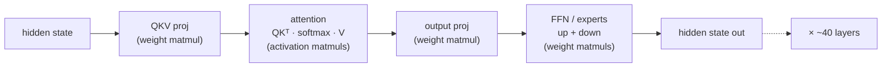
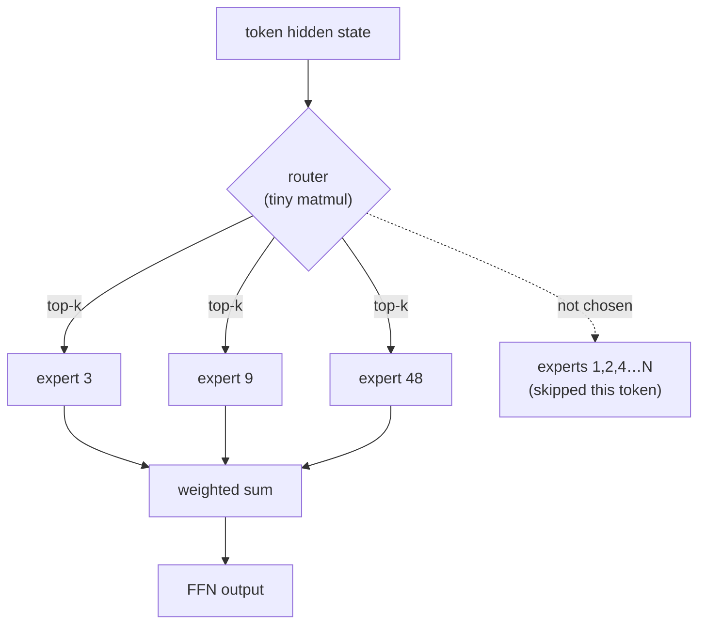
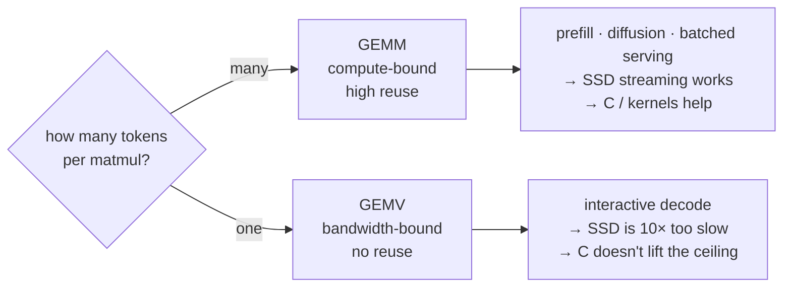

# Matmul shapes and the decode wall

*Why an LLM's speed is decided by the shape of its matrix multiplies, and why "SSD is the new VRAM" is true for some workloads and false for chat.*

> Written as the long-form backing for a reply to a LinkedIn post by **Pawel
> Bulowski**, about antirez's `h3-metal` (native C + Metal inference for
> MiniMax-H3, a 33B video+audio **diffusion** model). The post argued that
> "weights don't need to fit in RAM, they need to arrive on time" and that
> "SSD bandwidth is becoming the new VRAM."
> Post: https://lnkd.in/p/eJJKR7hr
>
> The claim is real, but it lives or dies on one variable: the **shape** of the
> matmul the workload is running. This doc is that variable, start to finish,
> anchored on Mira's own measured numbers (Qwen3.6-35B-A3B 4-bit, 32 GB Apple
> Silicon, decode measured at **58 tok/s single stream**, 2026-08-13).

---

## 1. A transformer is a chain of matmuls

The weights of an LLM *are* matrices. One decoder layer is a short pipeline of
matrix multiplies, and almost all of the time and bytes live in them. Everything
else (layernorm, softmax, residual adds, RoPE) is cheap glue.



Two families of matmul appear:

- **Weight matmuls** — QKV, output projection, and the FFN/expert matrices. These
  read the *model weights* from memory. This is where residency and bandwidth bite.
- **Activation matmuls** — `Q·Kᵀ` and `softmax·V` inside attention. These read the
  *KV cache*, not the weights, and they grow with context length (Case 2 below).

"Where does inference time go" reduces to "how do these matmuls behave," and that
answer flips completely depending on how many tokens you push through at once.

---

## 2. The master variable: GEMM vs GEMV

Same weight matrix `W`. Feed it many tokens or one token, and you get two different
machines.

```
PREFILL  (T tokens at once)            DECODE  (1 token at a time)
                                        
  W        X          Y                  W        x        y
[d × d] · [d × T]  = [d × T]           [d × d] · [d × 1] = [d × 1]
                                        
matrix × MATRIX  → GEMM                matrix × VECTOR  → GEMV
each W element reused T times          each W element used ONCE
math units stay busy                   waiting on memory reads
```

| | Prefill (many tokens) | Decode (one token) |
|---|---|---|
| Matmul shape | matrix × **matrix** (GEMM) | matrix × **vector** (GEMV) |
| Weight reuse | ×T (the whole prompt) | ×1 (none) |
| Bottleneck | **compute** (GPU math units) | **memory bandwidth** (reading W) |
| Arithmetic intensity | high | ~O(1) |
| Mira measured | 500–19,000 tok/s | **58 tok/s, flat** |

Prefill stacks the prompt's token vectors into a matrix, so each weight is loaded
once and reused across every column. Decode has a single column, so each weight is
read from memory, used for one multiply-add, and discarded. There is nothing to
amortize the read against. Decode time is simply:

```
time per token  ≈  (bytes of weights read)  /  (memory bandwidth)
```

**That is why "memory bandwidth is the clock."** It is also, exactly, why antirez's
SSD-streaming trick works: a diffusion DiT block is a GEMM over thousands of image
patches (compute-bound, huge reuse), so a 14 GB/s read of the next block hides
behind seconds of GPU math. Decode has no such slack.

---

## 3. The roofline: why intensity decides everything

Arithmetic intensity = FLOPs performed per byte loaded from memory. Plot achievable
throughput against it and you get the **roofline**: a bandwidth-limited ramp on the
left, a compute-limited ceiling on the right, meeting at the *ridge point*.

```
 throughput
 (FLOP/s)
   ^
   |                _______________  compute ceiling (GPU peak)
   |               /
   |              /
   |   bandwidth /   ← slope = memory bandwidth
   |   limited  /
   |           /
   |    GEMV  •         • GEMM (large T)
   |   (decode)          (prefill / diffusion)
   +---------•-----------•------------------>  arithmetic intensity
           ~4          ridge          (FLOP/byte)
```

Worked numbers, 4-bit weights (0.5 byte each):

- **GEMV (decode).** A `d×d` projection reads `0.5·d²` bytes and does `2·d²` FLOPs
  → intensity ≈ **4 FLOP/byte**. Far left of the ridge. Bandwidth-bound.
- **GEMM (prefill / diffusion), batch T.** Reads the same `0.5·d²` bytes but does
  `2·d²·T` FLOPs → intensity ≈ **4·T FLOP/byte**. A few dozen tokens already push
  you past the ridge into compute-bound territory.

On Apple Silicon the ridge sits at tens of FLOP/byte. Decode at ~4 is nowhere near
it, so it rides the bandwidth ramp. This is the entire argument in one picture:
**move a bandwidth-bound point and neither a faster SSD nor a C rewrite helps —
you're on the sloped part of the graph, and the slope is the memory bus.**

Sanity check against Mira's 58 tok/s: ~3B active params × 0.5 byte ≈ 1.5 GB of
weight reads per token, at 58 tok/s that is ~90 GB/s of weight traffic alone,
before KV and attention. Consistent with a machine whose peak bandwidth is in the
low hundreds of GB/s — an order of magnitude over a single 14 GB/s SSD, not 40×.

---

## Case 1 — MoE routing: the same GEMV, but now data-dependent

Qwen3.6-35B-A3B is a Mixture of Experts: **35B total parameters, ~3B active per
token** (that is what "A3B" means). Each FFN block is replaced by a large pool of
expert matrices plus a small **router** that, per token, picks a handful to run.



Two consequences, both central to this thread:

**(a) Decode is still a GEMV, just over the active slice.** Only the chosen experts'
matrices are read, so per token you touch ~3B params, not 35B. Good for capacity,
but the *shape* is unchanged: one token, no reuse, bandwidth-bound. MoE lowers the
bytes-per-token; it does not turn decode into a GEMM. The 58 tok/s wall is a GEMV
wall over the 3B active slice.

**(b) Routing is decided at runtime, which breaks SSD prefetch.** The whole reason
antirez's double-buffer works is that a diffusion model executes its blocks in a
**fixed, known order** — the background reader always knows the next block, so it
can start the SSD read early. MoE routing is the opposite: *which* experts a token
needs is computed by the router one step before you need them, and it changes token
to token.

```
Diffusion DiT                         MoE decode
block order known in advance          next experts unknown until the
  read block N+1 while GPU              router runs → cannot prefetch
  runs block N   ✅ overlaps            → SSD read is on the critical path ❌
```

So streaming MoE experts from SSD is *worse* than streaming a diffusion model, not
better: you would stall on a random-access SSD read every single token, with no way
to hide it. This is why Mira's answer to "35B won't fit" is **lazy expert loading**
(`load(lazy=True)`, peak 18.2 → 7.25 GB) — let the OS keep only touched experts hot
in *RAM*, where a bandwidth-bound GEMV can actually be fed. It is a capacity trick,
not a speed trick, and it deliberately never reaches for the SSD on the hot path.

---

## Case 2 — KV-cache attention: the matmul that grows with context

The weight matmuls are a fixed cost per token. The **attention** matmuls are not:
they scale with how much context you have already generated, because each new token
attends over every previous token's keys and values.

At decode position `t`, with one query vector `q` and a cache of `t` past keys/values:

```
scores   =  q · Kᵀ        [1 × d] · [d × t]  =  [1 × t]     ← grows with t
weighted =  softmax(scores) · V   [1 × t] · [t × d] = [1 × d]  ← grows with t
```

```
context t = 1k        t = 16k              t = 64k
K,V read: ~small      16× larger           64× larger
                                            
FFN/proj weights:  CONSTANT per token (Case 1)
KV cache reads:    LINEAR in context  ← eventually dominates
```

Both attention matmuls read the KV cache from memory, so they are **also
bandwidth-bound**, and their cost climbs linearly with context length. The picture
of a single decode step is therefore two bandwidth costs added together:

- a **constant** term — reading the active weights (Case 1), and
- a **linear-in-context** term — reading the growing KV cache.

At short context the weight term dominates, which is the regime Mira's 58 tok/s was
measured in (512–1024 tokens generated from a short prompt). At long context the KV
term catches up and decode slows down. That is why:

- Mira runs the engine with **`--kv-bits 8`** — quantizing the KV cache halves the
  bytes read per token, directly buying back decode speed at long context.
- **`--max-kv-size 128000`** bounds how large that linear term is allowed to grow.
- The **prompt cache / boundary snapshots** matter: they let prefill skip re-reading
  a shared prefix, but they cannot touch the per-token KV *reads* during decode —
  those are structural to the attention matmul.

So the two cases together define the decode budget: a flat weight-GEMV floor (Case 1)
plus a context-dependent KV-attention ramp (Case 2), both paid in memory bandwidth,
neither helped by a faster disk or a lower-level language.

---

## Putting it back together



- **Prefill and diffusion are GEMMs.** High reuse, compute-bound, sitting right of
  the ridge. SSD streaming and hand-written C kernels both pay off, because the
  bottleneck is math you can overlap or accelerate. This is antirez's world.
- **Interactive decode is a GEMV.** No reuse, bandwidth-bound, on the sloped part of
  the roofline. A faster SSD cannot help (14 GB/s is an order of magnitude under
  RAM), and a C rewrite cannot help (the matmul already runs in native Metal; Python
  only launches the graph). The wall is the memory bus.
- **Batching is the lever between them.** Stack `B` sequences and decode's GEMV
  becomes a GEMM with reuse `B`, climbing back toward the ridge. That is why
  throughput-oriented *batch* offload (FlexGen-style) can stream from SSD while a
  single interactive stream cannot — and why batch size even changes the numerics,
  because batch 1 and batch 4 take different kernel paths.

The one-line version: **the matmul shape is the master variable.** Many tokens in →
matrix-matrix → SSD and C both help. One token in → matrix-vector → neither does.
Mira's 58 tok/s is a GEMV number, and every claim in that LinkedIn thread is really
a statement about which of those two shapes the workload is running.

---

## References

- LinkedIn post by Pawel Bulowski, about antirez's `h3-metal`: https://lnkd.in/p/eJJKR7hr
- Roofline model: Williams, Waterman, Patterson, *Roofline: an insightful visual
  performance model for multicore architectures*, CACM 2009.
- FlexGen (batched SSD-offloaded LLM inference, the compute-bound regime): Sheng et
  al., 2023.
- Mira measured decode: `notes/ssd-weight-streaming-applicability.md` (this repo),
  Qwen3.6-35B-A3B-4bit, single stream, `scripts/bench_standard.py`, 2026-08-13.
