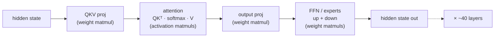
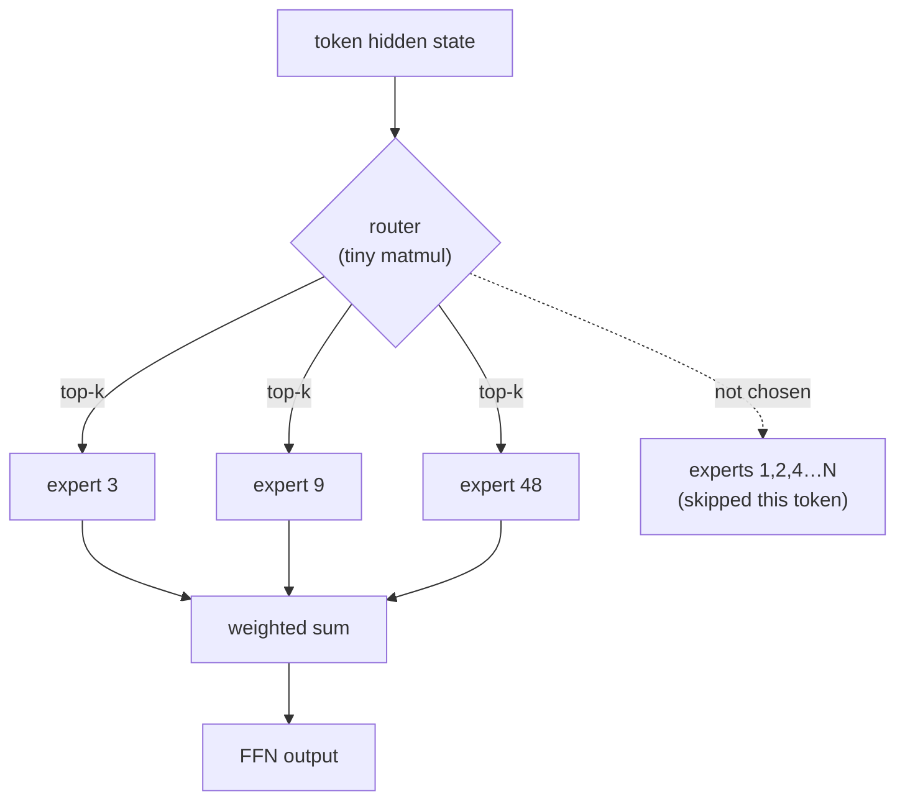
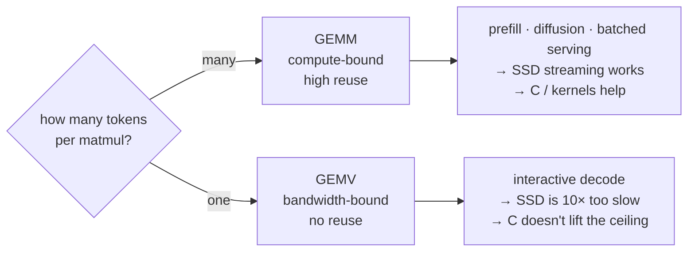

# Matmul shapes and the decode wall

*Why an LLM's speed comes down to the shape of its matrix multiplies, and why "SSD is the new VRAM" is true for diffusion and false for chat.*

> Background: this is the long version behind a reply I left on a LinkedIn post by
> Pawel Bulowski, about antirez's `h3-metal` (native C plus Metal inference for
> MiniMax-H3, a 33B video and audio diffusion model). The post's line was that
> "weights don't need to fit in RAM, they need to arrive on time," and that "SSD
> bandwidth is becoming the new VRAM." For the workload he's running, I think that's
> right. The catch is it flips completely for the workload most of us run locally,
> and the thing that decides which way it goes is a single variable: the shape of the
> matmul. Post: https://lnkd.in/p/eJJKR7hr
>
> The numbers here are from my own machine (Qwen3.6-35B-A3B 4-bit, 32 GB Apple
> Silicon), decode measured at 58 tok/s single stream on 2026-08-13. One machine, one
> model; don't over-read it.

---

## Start in the kitchen

Before any matrices, the homely version. Reading a weight out of memory is like
walking to the pantry for an ingredient. The multiply you do with it is the cooking.

Making fifty pancakes at once, you walk to the pantry once for the flour and use it
fifty times; the walking barely counts, the stove is your limit. That is prefill.
That is antirez's diffusion model too.

Make one pancake, plate it, then start the next, and now you walk to the pantry for
every ingredient of every pancake. The walking is the whole afternoon, and a fancier
stove buys you nothing. That is decode. That is chat.

The rest of this doc is that same picture, with the real shapes.

---

## A transformer is a chain of matmuls



The weights of an LLM are matrices, and one decoder layer is a short run of matrix
multiplies with cheap glue in between (layernorm, softmax, the residual adds, RoPE).
Two kinds of matmul show up, and the difference matters later. Some read the model
weights: the QKV projection, the output projection, the FFN or expert matrices. Those
are where residency and bandwidth bite. The others read the KV cache instead, inside
attention (`Q·Kᵀ` and `softmax·V`), and they grow with how much context you have
already written (that is Case 2).

So where does the time go? Into those matmuls. And the answer changes completely
depending on how many tokens you push through at once.

---

## The one variable that matters: GEMM vs GEMV

Same weight matrix `W`. Push many tokens or one token, and you get two different
machines.

```
PREFILL  (T tokens at once)            DECODE  (1 token at a time)

  W        X          Y                  W        x        y
[d × d] · [d × T]  = [d × T]           [d × d] · [d × 1] = [d × 1]

matrix × MATRIX  → GEMM                matrix × VECTOR  → GEMV
each W element reused T times          each W element used ONCE
math units stay busy                   waiting on memory reads
```

| | Prefill (many tokens) | Decode (one token) |
|---|---|---|
| Matmul shape | matrix × matrix (GEMM) | matrix × vector (GEMV) |
| Weight reuse | ×T (the whole prompt) | ×1 (none) |
| Bottleneck | compute (GPU math units) | memory bandwidth (reading W) |
| Arithmetic intensity | high | ~O(1) |
| Measured here | 500–19,000 tok/s | 58 tok/s, flat |

Feed it the whole prompt and each weight is loaded once and reused across every
column; the math units stay busy (a GEMM, matrix times matrix). Feed it one token and
each weight is read, used for a single multiply-add, and thrown away, with nothing to
reuse it against (a GEMV, matrix times vector). Decode is the second one, and its time
is almost embarrassingly simple:

```
time per token  ≈  (bytes of weights read)  /  (memory bandwidth)
```

That is why people say memory bandwidth is the clock. It is also why the SSD trick
works for antirez: a diffusion block is a GEMM over thousands of image patches,
seconds of GPU work, so a 14 GB/s read of the next block hides behind it with room to
spare. Decode gives you no such room.

---

## The roofline: intensity decides

Arithmetic intensity is FLOPs done per byte loaded from memory. Plot throughput
against it and you get the roofline: a bandwidth-limited ramp on the left, a
compute-limited ceiling on the right, meeting at the ridge point.

```
 throughput
 (FLOP/s)
   ^
   |                _______________  compute ceiling (GPU peak)
   |               /
   |              /
   |   bandwidth /   ← slope = memory bandwidth
   |   limited  /
   |           /
   |    GEMV  •         • GEMM (large T)
   |   (decode)          (prefill / diffusion)
   +---------•-----------•------------------>  arithmetic intensity
           ~4          ridge          (FLOP/byte)
```

The math, on 4-bit weights (half a byte each):

- GEMV (decode). A `d×d` projection reads `0.5·d²` bytes and does `2·d²` FLOPs, so
  intensity is about 4 FLOP/byte. Far to the left of the ridge. Bandwidth-bound.
- GEMM (prefill or diffusion), batch T. Reads the same `0.5·d²` bytes but does
  `2·d²·T` FLOPs, so intensity is about `4·T` FLOP/byte. A few dozen tokens already
  carry you past the ridge into compute-bound.

On Apple Silicon the ridge sits at tens of FLOP/byte, and decode at ~4 is nowhere
near it, so it rides the bandwidth ramp. That is the whole thing in one picture: move
a bandwidth-bound point and neither a faster SSD nor a C rewrite helps you, because
you are on the sloped part of the graph and the slope is the memory bus.

A quick check against the 58 tok/s: about 3B active params at half a byte is roughly
1.5 GB of weight reads per token, and 58 of those a second is ~90 GB/s of weight
traffic alone, before KV and attention. That fits a machine whose peak bandwidth is
in the low hundreds of GB/s, an order of magnitude over a single 14 GB/s SSD (not
40×, which is the number I nearly wrote before doing this arithmetic).

---

## Case 1: MoE routing, the same GEMV but now it is guessing

Qwen3.6-35B-A3B is a Mixture of Experts: 35B parameters in total, about 3B of them
active on any given token (that is what the "A3B" is telling you). Each FFN block
becomes a big pool of expert matrices plus a small router that picks a handful per
token.



Two things follow, and both bear on the SSD argument.

First, decode is still a GEMV, just over the slice the router picked. You touch about
3B params instead of 35B, which is lovely for fitting the model, but the shape has not
changed: one token, no reuse, waiting on memory. MoE makes each token cheaper in
bytes; it does not hand you the reuse that would make streaming pay off.

Second, the sharp one: the router decides which experts you need at runtime, one step
before you need them. antirez's double-buffer works because a diffusion model runs its
blocks in a fixed order he knows in advance, so the background reader always knows what
to fetch next. MoE routing is the opposite. You do not know which experts the next
token wants until the router runs, so you cannot start the SSD read early, and a
random-access read off the disk lands right on the critical path.

```
Diffusion DiT                         MoE decode
block order known in advance          next experts unknown until the
  read block N+1 while GPU              router runs → cannot prefetch
  runs block N   ✅ overlaps            → SSD read is on the critical path ❌
```

So streaming experts off SSD is worse than streaming a diffusion model: you would
stall on a random read every token, with nowhere to hide it. Which
is why the answer, when 35B will not fit, is to keep only the experts you actually
touch hot in RAM and let the rest sit (lazy loading took peak memory from 18.2 to 7.25
GB here). It buys capacity, not speed, and it stays well away from the disk on the hot
path.

---

## Case 2: attention, the matmul that grows on you

The weight matmuls cost the same every token. Attention does not. Every new token has
to look back over every token it already wrote, so the attention matmuls get bigger as
the conversation gets longer.

At decode position `t`, with one query vector `q` and a cache of `t` past keys and
values:

```
scores   =  q · Kᵀ        [1 × d] · [d × t]  =  [1 × t]     ← grows with t
weighted =  softmax(scores) · V   [1 × t] · [t × d] = [1 × d]  ← grows with t
```

```
context t = 1k        t = 16k              t = 64k
K,V read: ~small      16× larger           64× larger

FFN/proj weights:  CONSTANT per token (Case 1)
KV cache reads:    LINEAR in context  ← eventually dominates
```

Both of those read the KV cache from memory, so they are bandwidth-bound too, and they
grow linearly with context. Picture one decode step as two bills added together: a
flat one for reading the active weights (Case 1), and a growing one for reading the KV
cache. Early in a conversation the weights dominate, which is the regime the 58 tok/s
was measured in (a short prompt, 512 to 1024 tokens out). Let the context stretch to
tens of thousands of tokens and the KV bill catches up, and decode slows down.

Worth being exact about what the KV cache actually buys, because it gets over-credited.
It saves you from recomputing attention over the whole prefix on every token, which is
enormous and non-negotiable. It does not make decode compute-efficient: the per-token
projections are still a narrow GEMV, and only batching changes that shape. The cache
removes redundant work; it does not move you off the bandwidth ramp.

That is the reason behind a few knobs that otherwise look arbitrary. The engine runs
the KV cache at 8-bit (`--kv-bits 8`), which halves the bytes read per token and hands
the speed back; it caps how far the cache can grow (`--max-kv-size 128000`); and it
leans on a prompt cache so prefill can skip re-reading a shared prefix. What the prompt
cache cannot do is touch the per-token KV reads during decode. Those are baked into the
attention matmul, and no cache saves you from them.

Put the two cases together and the whole decode budget is a flat weight floor plus a
context ramp, both paid in memory bandwidth, neither one helped by a faster disk or a
lower-level language.

---

## So, back to the post



Prefill and diffusion are GEMMs: plenty of reuse, compute-bound, sitting on the flat
part of the roofline where the GPU's math is the limit. Stream from SSD, hand-write
Metal kernels in C, both pay off, because the bottleneck is math you can overlap or
speed up. That is the world antirez is in, and it holds up there.

Interactive decode is a GEMV: no reuse, bandwidth-bound, stuck on the sloped part. A
faster SSD does not help (14 GB/s is an order of magnitude under RAM), and rewriting
the loop in C does not help either, because the matmul already runs in native Metal;
Python only launches it. The wall is the memory bus, and you do not argue with a bus.

The one lever that moves you between the two is batching. Stack 32 conversations and
decode's GEMV becomes a GEMM with 32-way reuse, climbing back toward compute-bound.
That is why a server doing batch work can stream off SSD while your single chat stream
cannot, and it is the same reason batch size quietly changes the output: batch 1 and
batch 4 take different kernel paths.

So the whole thread, the byte counts, the missing tok/s, the "SSD is the new VRAM," is
one question wearing different hats: how many tokens go through the matmul at once?
Many, and the disk is your friend. One, and the memory bus was the wall all along, and
it still is.

---

## Where this goes next

Batching is really one instance of a bigger rule: efficient inference is mostly the art
of turning the workload into well-fed matrix-matrix work, and keeping it there (that
framing is Utsab Sapkota's, in the references). Batching does it across users. For a
single local user there is another way in, speculative decoding: let a cheap draft guess
a few tokens ahead, then have the big model verify all of them in one GEMM-shaped pass
instead of a GEMV per token, spending the compute that was sitting idle anyway.

On a dense model that is close to free latency. On an MoE it bites again, because
verifying several guessed tokens has to load the union of the experts they route to, so
the reuse leaks straight back out through the same runtime routing that broke prefetch in
Case 1. Predict that routing a step ahead and you might close both holes at once. That
part is not solved. It is the thread I want to pull.

---

## References

- LinkedIn post by Pawel Bulowski, about antirez's `h3-metal`: https://lnkd.in/p/eJJKR7hr
- Utsab Sapkota, *GEMM and GEMV: the hidden divide that shapes LLM inference
  performance*, Medium, 2026 (a clean conceptual companion; the "well-fed matrix-matrix"
  framing is his): https://medium.com/@utsabsapkota4231/gemm-and-gemv-the-hidden-divide-that-shapes-llm-inference-performance-d9e4ba81b871
- Roofline model: Williams, Waterman, Patterson, *Roofline: an insightful visual
  performance model for multicore architectures*, CACM 2009.
- FlexGen (batched SSD-offloaded LLM inference, the compute-bound regime): Sheng et
  al., 2023.
- Mira measured decode: `notes/ssd-weight-streaming-applicability.md` (this repo),
  Qwen3.6-35B-A3B-4bit, single stream, `scripts/bench_standard.py`, 2026-08-13.
