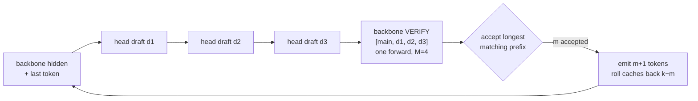
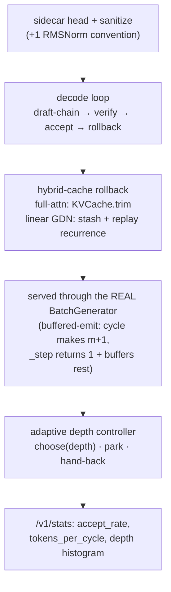
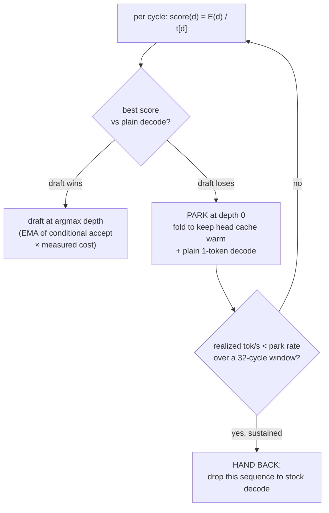
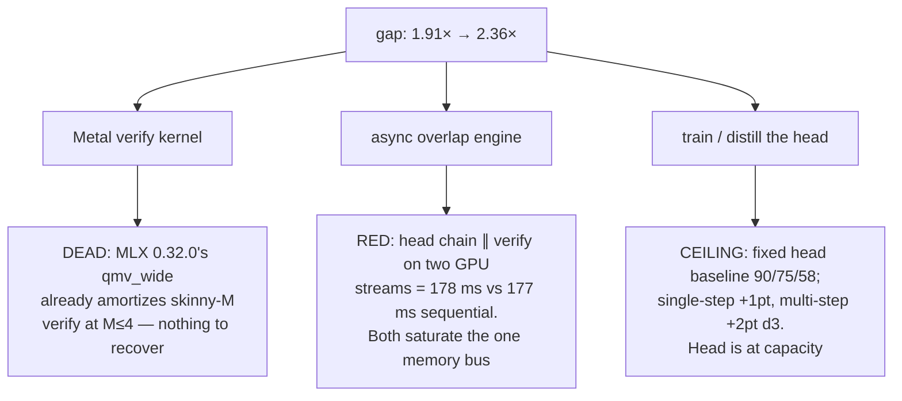
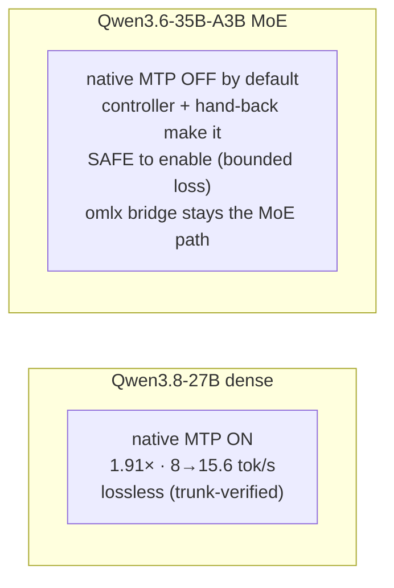

# Multi-token prediction on an M5

*Building self-speculative decoding into Mira's own engine: what it took, what it
won, and the three ways I tried to push it further that didn't work.*

> This is the thread the [decode-wall doc](matmul-shapes-and-the-decode-wall.md) ends
> on. Decode is a GEMV — one token, no reuse, stuck on the memory-bandwidth ramp — and
> the one single-user lever that changes the *shape* of that matmul is speculative
> decoding: let a cheap draft guess a few tokens ahead, then have the big model verify
> all of them in one GEMM-shaped pass, spending the compute that was sitting idle
> anyway. This doc is me actually pulling that thread, end to end, in mira-mlx.
>
> Every number here is from one machine (Qwen3.8-27B and Qwen3.6-35B-A3B, 4-bit, 32 GB
> M5), measured with production down and a fresh in-process engine, `MLX_ENABLE_TF32=0`.
> One machine, two models; don't over-read it.

---

## What MTP is

Multi-token prediction (MTP) is self-speculative decoding where the draft model isn't a
separate small model — it's a tiny extra head bolted onto the big model itself. A single
transformer block (the "MTP head", DeepSeek-V3 style) reads the backbone's last hidden
state plus the token just emitted, and predicts the *next* token. Chain it: feed the
head its own output and it drafts two, three tokens ahead. Then the backbone verifies
the whole guessed run in one forward pass.



The economics are the whole point. A verify over `M` tokens costs almost the same as a
decode over 1 — it's the same weight read, amortized across the window (I measured the
verify forward at **1.03× a single-token forward**; it's essentially free). So if the
head guesses right `m` times, you got `m+1` tokens for the price of ~one decode step.
The draft chain is cheap, the verify is nearly free, and every emitted token is still
chosen by the full backbone — so **correctness is invariant**: a bad head costs speed,
never accuracy. That invariant is what made it safe to run training and benches
unattended.

---

## The bar, and the reframe

The reference is [omlx](omlx-ctl.md) (Jun Kim / @jundot, solo dev, Apache-2.0), which
runs MTP as a monkey-patch on mlx-lm. On this same hardware it gets:

| omlx | speedup | base → MTP tok/s | d1 accept |
|---|---|---|---|
| Qwen3.8-27B **dense** | **2.36×** | 8.1 → 19.13 | ~89% |
| Qwen3.6-35B-A3B **MoE** | **1.38×** | 57.97 → ~73 | ~94% |

I didn't want to *depend* on omlx sitting beside mira-mlx. The goal was never "model
independence" (all of Mira is Qwen-shaped and a real MTP head only deepens that) — it
was **engine self-sufficiency**: mira-mlx owning its own fast decode path. "Novel" here
means self-authored, not different-from-everything: read omlx and the papers to
understand the mechanism, then write original code. So the bar was omlx's numbers, and
losslessness, with the head auto-sourced and zero manual setup.

---

## What I built

The head is a bf16 sidecar (`model-mtp.safetensors`, ~1.6 GB) that sits over the 4-bit
backbone. Mira assembles a combined model dir, loads it lazily, and attaches the head by
an idempotent monkey-patch (mlx-lm builds classes from its own registry, so a subclass
never constructs). The decode loop was the hard part, built in layers over several
sessions:



The rollback is subtler than "trim the KV cache" because Qwen3.6-35B-A3B is a *hybrid*
model: 10 of 40 layers are full attention (trimmable KV), the other 30 are linear
GatedDeltaNet layers carrying a recurrent SSM state that a trim can't undo. Rejected
drafts have to stash each linear layer's pre-forward state and replay only the
recurrence over the accepted slice — no second forward, no lost speedup.

Buffered-emit is the trick that let this ride the real serving path without touching
BatchGenerator's accounting: a cycle produces `m+1` tokens, `_step` hands back exactly
one and buffers the rest, and later `_step` calls drain the buffer forward-free. It
engages only for width-1 text (the production config) and falls back to stock decode for
anything else, so it's never *less* correct than base mlx-lm.

---

## "Lossless" doesn't mean bit-identical

The spec's original gate was "byte-identical to non-MTP greedy." On M5 4-bit that gate
is **infeasible and it's the wrong bar** — and proving that took a while.

The verify projects a `k+1`-token window through the 4-bit quantized matmul, and on M5 a
quantized matmul returns a *different* position-0 result for a width-4 window than for a
width-1 window, from byte-identical position-0 input. This is the standing
[batched-divergence](matmul-shapes-and-the-decode-wall.md) behaviour: batch size changes
the kernel path and the last-ULP result. So "MTP output ≠ single-token greedy output" is
guaranteed — but it's meaningless, because single-token greedy is itself just *one*
numerical realization.

I found the token-stream oracle useless with a control: **stock single-token decode
diverges from plain greedy on 176 of 200 tokens** on this hardware. The oracle that
works is **teacher forcing** — one multi-token pass over the arm's own output, checking
each token is the argmax there. By that measure MTP is model-greedy at **199/200,
exactly as lossless as stock decode** (also 199/200 — one irreducible near-tie each).

omlx's own source says the same thing in its own words: its verify kernel "can
occasionally diverge from the unrouted path… the token is still trunk-verified." So the
honest definition, for every MTP implementation on this hardware including the reference,
is **trunk-verified quality-equivalence, not bit-identity**.

---

## The central finding: MTP is a dense win and an MoE trap

The single most important result of the whole workstream is that MTP's payoff is
opposite on the two model types — and it's the decode-wall roofline that explains it.

```
DENSE 27B (bandwidth-bound)              MoE 35B-A3B (compute-bound)

decode ~8 tok/s, ~125 ms/token          decode ~59 tok/s, ~17 ms/token
  slow token → the draft+verify           fast token → the draft head is
  cycle overhead HIDES behind it          itself ~a full forward; the cycle
  → MTP WINS                              overhead SWAMPS the token saved
                                          → MTP LOSES
```

A dense token is a big, slow, bandwidth-bound GEMV; the MTP cycle's fixed overhead (the
draft chain + a wider verify + host sync) is small next to it, so speculation pays. An
MoE token is already cheap — ~3B active params, ~17 ms — so the same fixed overhead is
*larger* than the token it saves. Measured, fully resident (no offload):

| | dense 27B | MoE 35B-A3B |
|---|---|---|
| base decode | 8.3 tok/s | 59.0 tok/s |
| native MTP (served) | **1.91×** | **0.87×** (net-negative) |

That number decided the product: **native MTP is a dense-only feature.** On the MoE it's
off, and the controller (below) exists to make sure "off" happens automatically when it
should. `MIRA_MLX_MTP_ENABLED` defaults to `False` precisely so the MoE loss never
reaches production.

---

## The bug that was most of the win: a norm-shift misclassification

The single biggest lever wasn't a kernel or a retrain — it was a one-line weight-loading
fix. MLX-converted models center their RMSNorm gammas near 1; raw-HuggingFace weights
center them near 0, so the head sidecar (raw-HF) needs a `+1` shift at load. The
sanitizer decided that shift *per key* with a `mean(gamma) < 0.5` heuristic — and three
head norms have raw gammas *above* 0.5:

```
head norm         raw gamma   heuristic says   truth      result if unshifted
q_norm              0.79      "already MLX"     raw-HF     attention Q at 0.79 not 1.79
k_norm              0.78      "already MLX"     raw-HF     attention K at 0.78 not 1.78
mtp.norm            1.25      "already MLX"     raw-HF     head logits flattened
```

So q/k were scaled to ~44% of correct, corrupting the head's own attention in a way that
*compounds down the draft chain* — d1 survives on short context, d2/d3 collapse. The fix
is to stop deciding per-key: a sidecar carries one convention, so read it once from the
norms that *reliably* center near 0 when raw-HF (`pre_fc_*` and the head's layer norms)
and shift every head norm uniformly. This is exactly the misclassification omlx
documents and fixes the same way.

```
dense accept, per draft depth      served speedup
              d1   d2   d3
before fix    83   52   29          1.67×
after  fix    87   71   56          1.91×
                    ↑    ↑
             the gain lands exactly where the
             compounding-attention theory predicts
```

A pure weight-loading fix, no retrain, no kernel, closed ~40% of the gap to omlx's 2.36×
and is the reason dense MTP is worth shipping at all.

---

## The controller: draft when it pays, park when it doesn't

A fixed draft depth is wrong on principle — the right depth depends on how predictable
the current text is, and on the MoE it's often *zero*. So the decode loop runs an
adaptive depth controller, pure host-side bookkeeping (no model change, no kernel), that
ports omlx's `_DepthController`:



`E(d)` is the expected tokens per cycle at depth `d` from an EMA of *conditional* accept
per position; `t[d]` is the measured wall-clock cost. The controller settles at **depth-2
on dense** (and correctly never parks there), and **parks ~93% of cycles on the MoE**,
where it measured that speculation loses. When parking isn't enough — the sequence is
drafting but still losing throughput — a global **hand-back** drops that sequence
entirely to stock decode, detected by *realized throughput* over a window (an earlier
park-fraction signal turned out to be anti-correlated with loss once I benched resident,
not offloaded). Net effect on the MoE: the old fixed-depth net-negative (0.79–0.92×)
becomes bounded-then-neutral (~0.92× worst case, then pure stock), lossless across the
boundary. On dense the whole hand-back path stays dormant.

---

## Three ways I tried to reach omlx's 2.36×, and why each failed

Dense landed at 1.91×; omlx gets 2.36×. I chased that gap three ways. All three are now
closed — and I'm writing them down because each was a real, measured *no*, not a hunch.



**The verify kernel.** omlx ships a custom Metal skinny-M verify kernel, and for a long
time I read that as its real edge. Then I profiled it: on our MLX (0.32.0) `qmv_wide`
already amortizes the skinny-M verify at the depth we run (M≤4), so a hand-rolled kernel
has nothing left to recover. Every "this is the lever" predates that measurement; the
measurement is the answer. Dead unless a future MLX regresses `qmv_wide`.

**The async overlap engine.** The idea: pipeline draft `N+1` behind verify `N` so the
~50 ms draft chain hides behind the ~125 ms verify. I built a feasibility spike before
the engine — ran the head chain and the verify forward on two separate MLX GPU streams
and compared concurrent vs sequential:

```
head chain alone            50.6 ms
verify forward alone       125.2 ms
ideal overlap (perfect)    125.2 ms   ← floor if the head fully hid
sequential                 176.8 ms
concurrent (two streams)   178.4 ms   ← pinned at sequential, +1.7 ms WORSE
```

Both are 4-bit matmuls reading weights out of one unified-memory bus; two command queues
just contend for the same bandwidth. Zero overlap. This is the decode wall again — the
overlap idea silently assumed the head had spare bandwidth to borrow during verify, and
on a bandwidth-bound machine there is none. The sequential design's 1.91× is the true
engine ceiling.

**Training the head.** The last idea was to lift accept by training (Mira's first-ever
training run). The head trains in bf16 with the backbone frozen; correctness stays
invariant, so it's safe. But on the *fixed* head it's exhausted:

| dense accept (chain-ceiling) | d1 | d2 | d3 |
|---|---|---|---|
| fixed-head baseline | 90 | 75 | 58 |
| + single-step retrain | 91 | 76 | 59 |
| + multi-step FastMTP chain loss | 90 | 75 | 60 |

I built the recipe that *should* work — multi-step FastMTP, which unrolls the draft chain
during training and feeds the head its own hidden state, attacking the exposure bias that
single-step training structurally can't (single-step always trains on ground-truth
inputs; the chain never learns to correct its own drift). It moved d3 by two points and
plateaued by epoch 2. The head is at its capacity ceiling: a 424M-param single block
can't reproduce the backbone's deep-context predictions better than this. And that result
also forecloses the *opposite* idea — a smaller, cheaper head to shrink the draft chain —
because a head with *less* capacity can only accept *less*, and the head is already the
binding constraint. The real accept win had already been banked by the norm-shift fix.

---

## Where it landed



| | result |
|---|---|
| Dense native MTP | **1.91×** served (8.3 → 15.6 tok/s), lossless, controller picks depth-2 |
| MoE native MTP | net-negative resident; **off by default**, controller+hand-back bound the loss |
| Losslessness | trunk-verified quality-equivalence (teacher-forced 199/200 = stock) |
| Accept in `/v1/stats` | `accept_rate`, `tokens_per_cycle`, per-depth + depth-chosen histogram |
| Levers closed | verify kernel (dead), async overlap (bandwidth-bound), head training (capacity) |

The honest summary: MTP in mira-mlx is a **self-sufficient dense speedup** — 8 to 15.6
tok/s, lossless, no oMLX.app beside it — and the norm-shift fix was most of that win.
Getting from 1.91× to omlx's 2.36× would take a genuinely bigger drafter (a Qwen3.8-class
step), not any further tuning of this head or this engine. On the MoE, the architecture
itself caps single-stream speculation: a ~3B-active token is too cheap to speculate on,
and the most valuable thing the controller does there is *decide not to*.

---

## References

- Decode-wall companion (why decode is bandwidth-bound, the roofline, the GEMV/GEMM
  divide): [matmul-shapes-and-the-decode-wall.md](matmul-shapes-and-the-decode-wall.md)
- MTP mechanism: DeepSeek-V3 technical report (single MTP head, trunk verification);
  FastMTP (self-distillation multi-step fine-tune); mlx-lm PR #990 (native Qwen3.5/3.6
  MTP base model).
- Reference implementation: omlx (Jun Kim / @jundot, Apache-2.0, omlx.ai) — the
  `_DepthController`, the trunk-verified losslessness stance, and the norm-shift fix are
  its prior art; attribution owed for anything ported. See [omlx-ctl.md](omlx-ctl.md).
- M5 quantized-matmul batch divergence (why bit-identity is the wrong bar):
  [quality-baseline.md](quality-baseline.md), and mlx issues #3897 / #3860 (closed
  won't-fix).
- Custom Metal kernels on Apple Silicon (why the verify kernel doesn't pay at our depth):
  [custom-kernels-on-apple-silicon.md](custom-kernels-on-apple-silicon.md).
